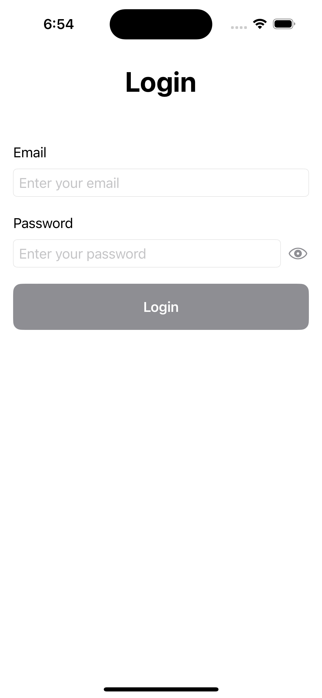
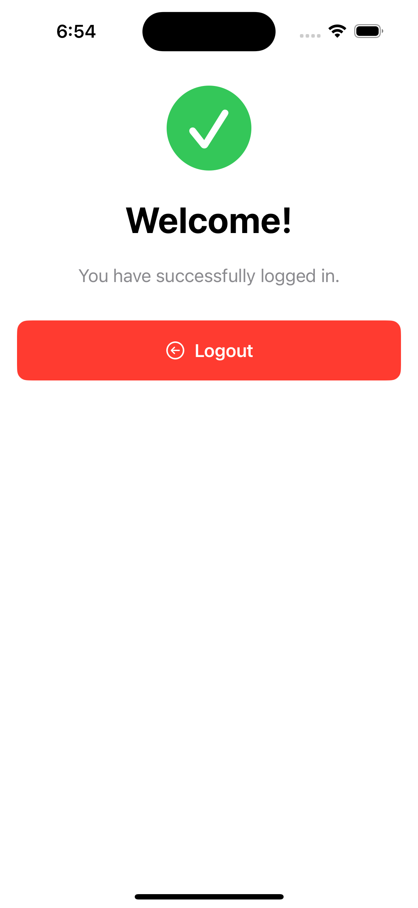

# SwiftUILoginDemo

A modern user authentication app (email + password) built with SwiftUI and MVVM, featuring async/await, a simple navigation manager, real-time validation, and clean keyboard dismissal.

## Features

- **SwiftUI Interface**: Modern, declarative UI built with SwiftUI
- **MVVM Architecture**: Clean separation of concerns with ViewModels
- **Async/Await**: Modern Swift concurrency for network operations
- **Real-time Validation**: Email/password are validated as you type
- **Navigation**: `NavigationStack` with a path and a simple `NavigationManager`
- **Keyboard Dismissal**: Via `@FocusState` (tap background to dismiss)
- **UI Reset**: Full view subtree reset using an `id` bound to a `uiResetToken`
- **Loading States**: Visual feedback during authentication
- **Error Handling**: Comprehensive error handling with user-friendly messages

## Requirements

- macOS Ventura 13.5 or later
- Xcode 15.0 or later
- iOS 17.0 or later

## Installation

1. Clone the repository using your preferred method.
2. Open the project with Xcode using `SwiftUILoginDemo.xcodeproj`.

## Usage

1. Build and run the project in Xcode on a simulator or physical device.
2. Enter the following email and password to simulate a successful login:
   - Email: `test@test.com`
   - Password: `password`
3. Tap the "Login" button to authenticate.
4. The app will show a loading indicator during authentication.
5. Upon successful login, you'll see a welcome screen with a logout option.

## Screenshots

| Login | Main |
| --- | --- |
|  |  |

## Architecture

The app follows the MVVM (Model-View-ViewModel) pattern:

- **Models**: `Source/Screen/Login/LoginModel.swift` (validation enums)
- **Views**: `Source/Screen/Login/LoginView.swift`, `Source/Screen/Main/MainView.swift`
- **ViewModels**: `Source/Screen/Login/LoginViewModel.swift` (business logic and state)
- **Services**: `Source/Service/LoginService/LoginService.swift` (conforms to `LoginServicing` for DI)
- **Navigation**: `Source/Navigation/NavigationManager.swift`

## Unit Tests

Run the unit tests from `SwiftUILoginDemoTests/SwiftUILoginDemoTests.swift`.
The tests cover login success/failure, validation, loading state, and reset behavior using a mock `LoginServicing` implementation.

- Coverage: `LoginViewModel` is at 100% line coverage.
